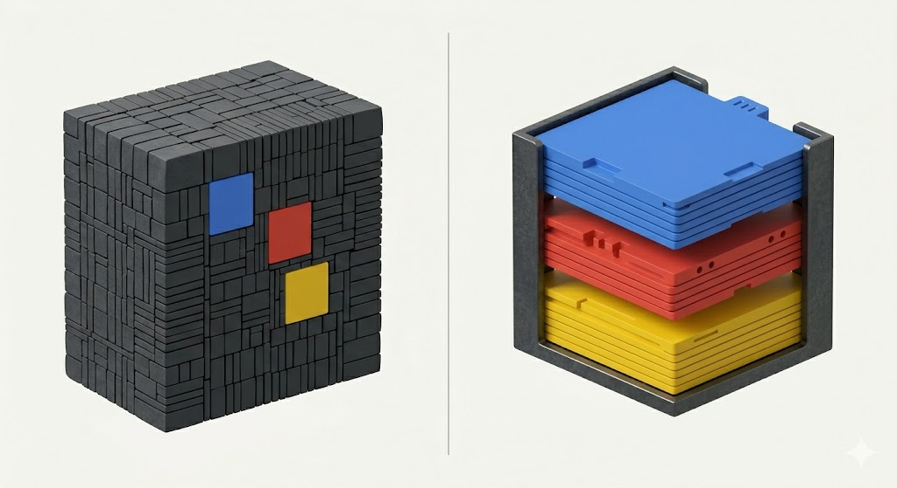
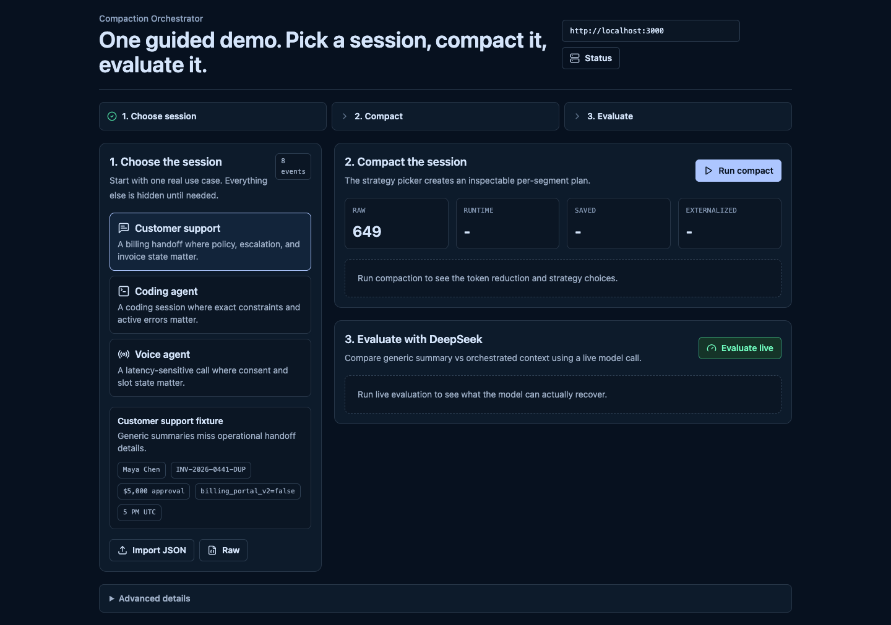

# Your Agent Does Not Need One Summary. It Needs a Compaction Plan.

Most long-running agents eventually hit the same wall.

The conversation is too long. The tool logs are noisy. The next model call needs context, but not all of it.

The default move is usually to trim the window, keep recent messages, or make one rolling summary.

That is the mistake.

An agent session is not one document. It is a working state. It contains user instructions, active errors, tool outputs, rejected approaches, policy constraints, account state, file paths, and next actions. If you flatten all of that into one summary, you are asking one text blob to do too many jobs.

Compaction should not be a hidden summarization step.

It should be a plan.

Compaction Orchestrator is a small open-source control layer for that plan. It stores the raw session, breaks it into context segments, chooses a compaction strategy per segment, and returns a smaller runtime context view plus an inspectable record of what happened.

Same session. Smaller context. Different survival rules.


The repo is here: [github.com/anshulLuhsna/compaction-orchestrator](https://github.com/anshulLuhsna/compaction-orchestrator)

## The Problem Is Not Context Length

Context length is the visible problem.

State loss is the real one.

A generic summary, or even a summary-plus-recent buffer, can preserve the narrative and still break the next turn. It may remember that there was a billing issue, but lose the duplicate invoice ID. It may remember that the coding agent had a type error, but blur the exact missing module. It may preserve the general user request, but drop the constraint that the agent must use Hono and not Express.

That is why "summary quality" is the wrong evaluation target.

The question is simpler and harsher:

```text
Can the next agent turn continue correctly after compaction?
```

That is what we now measure with **Agent Continuity under Compaction**, or ACCS.

## What a Compaction Plan Does

A compaction plan treats different context differently.

In the current alpha, a session goes through this shape:

```text
raw events
-> segment classification
-> strategy routing
-> compacted runtime context
-> inspectable plan
```

The built-in strategies are intentionally plain:

- `keep_verbatim`
- `extract_active_error`
- `externalize_for_retrieval`
- `mask_tool_output`
- `structured_summary`

The important part is not that these are magical strategies. They are not.

The important part is the boundary.

User instructions can be kept verbatim. Active errors can be extracted. Noisy tool output can be externalized. Completed exploration can be summarized. A customer-support handoff can preserve policy, escalation state, and next action.

One turn can use more than one strategy.

That is the product.

## The Failure Modes

One-size-fits-all memory usually fails in boring ways.

That is what makes them dangerous.



### 1. They Preserve Story, Not State

For a customer-support agent, "customer had a billing issue" is not enough.

The next turn needs the customer name, account ID, invoice IDs, refund policy, active entitlement error, escalation state, and what the agent should say next.

In our support fixture, the generic summary missed the duplicate invoice pair. Compaction Orchestrator preserved it.

That mattered in the live DeepSeek probe:

```text
generic_summary: 5/6 fact recall
compaction_orchestrator: 6/6 fact recall
```

Same model. Same fixture. Different context view.

### 2. They Blur Exact Strings

Coding agents often need exact strings, not vibes.

These are different facts:

```text
There was a typecheck issue.
```

```text
Cannot find module './billing-store.js'
no exported member 'billingRouter'
```

One tells the agent that something failed.

The other tells the agent what to fix.

Compaction Orchestrator can route active errors through `extract_active_error` instead of letting them dissolve into prose.

### 3. They Hide The Decision

Hidden compaction is hard to debug.

If the harness silently decides what survives, you cannot inspect the decision, compare strategies, or explain why the next agent turn went off track.

The plan is not a nice-to-have artifact.

It is the debugging surface.

## The Current Evidence

We compare seven candidates:

- `raw_full_context`
- `last_n_messages`
- `recent_token_window`
- `front_truncation`
- `generic_summary`
- `rolling_summary_recent`
- `compaction_orchestrator`

ACCS rewards critical fact recall, exactness, downstream readiness, recoverability, inspectability, and token reduction. It penalizes hallucinated or irrelevant retained context.

Latest deterministic results:

| Fixture | Generic summary ACCS | Strongest baseline ACCS | Orchestrator ACCS | Read |
| --- | ---: | ---: | ---: | --- |
| Coding agent | 0.548 | 0.698 | 0.836 | Rolling summary preserves facts, but uses more context and has no plan |
| Customer support | 0.410 | 0.474 | 0.773 | Stronger baseline still misses duplicate invoice state |
| Voice agent | 0.430 | 0.767 | 0.886 | Stronger baseline preserves facts, but saves fewer tokens and has no plan |

Latest live DeepSeek probe:

| Fixture | Generic summary | Compaction Orchestrator | Read |
| --- | ---: | ---: | --- |
| Customer support | 5/6 fact recall | 6/6 fact recall | Orchestrator wins clearly |
| Coding agent | 5/5 fact recall | 5/5 fact recall | Both answer probes, but orchestrator has the inspectable plan |

The support fixture is the clean live-model demo.

DeepSeek could recover every required next-turn fact from the orchestrated context. It missed the duplicate invoice pair from the generic summary.

The coding fixture shows a different point. DeepSeek answered the probes from both compacted contexts, but ACCS still prefers the orchestrator because the state is preserved with explicit operations and recoverability.

That distinction matters.

Sometimes the win is better recall.

Sometimes the win is control.

## What Ships In The Alpha

This is not a research sketch.

The repo currently has:

- SDK for agent loops
- CLI for JSON fixtures
- HTTP API for sidecar use
- SQLite persistence for sessions, events, plans, context views, and externalized content
- Web UI for demos and inspection
- Coding-agent, customer-support, and voice-agent fixtures
- ACCS evaluation scripts
- Optional live DeepSeek probe

The fastest path is the SDK:

```ts
import { compact } from "@compaction-orchestrator/core";

const result = compact({
  messages,
  objective: "Prepare context for the next agent turn.",
  policy: {
    mode: "balanced",
    preserveUserMessagesVerbatim: true,
    allowExternalRetrieval: true
  }
});

console.log(result.contextView.content);
console.log(result.plan.segments.map((segment) => segment.operation));
```

The demo path is the UI.

Load a fixture, run compaction, inspect the strategy choices, and compare against simple and summary-plus-recent baselines.



## What You Can Do With The Repo

If you want to try it, the repo is designed to be useful without reading the whole codebase.

Clone it:

```bash
git clone https://github.com/anshulLuhsna/compaction-orchestrator.git
cd compaction-orchestrator
npm install
```

Run the fastest demos:

```bash
npm run demo:coding
npm run demo:voice
npm run eval:accs
```

Run the UI:

```bash
npm run dev
npm run dev:web
```

Then open:

```text
http://127.0.0.1:5173
```

Use the SDK inside an agent loop when you want control at the model-call boundary. Use the HTTP API when you want a sidecar service with SQLite persistence. Use the fixtures and ACCS scripts when you want to test whether your own compaction strategy preserves the facts needed for the next turn.

That is the invitation: fork it, add a strategy, add a fixture from your own agent, and see whether the compaction plan actually helps the next turn continue.

## Comparison

| Dimension | One-size-fits-all memory | Compaction plan |
| --- | --- | --- |
| Main unit | Whole session | Context segment |
| Strategy | One rewrite | Per-segment routing |
| User constraints | Often paraphrased | Can be kept verbatim |
| Active errors | Often blurred | Extracted as error signal |
| Tool output | Summarized or retained blindly | Externalized with reference |
| Use-case behavior | Same shape everywhere | Different policies per use case |
| Debugging | Output only | Output plus plan |
| Evaluation | Summary resemblance | Next-turn continuity |

This is the core bet:

```text
The right abstraction is not compression.
The right abstraction is compaction control.
```

## What Is Still Unsound

The alpha is honest about its rough edges.

The classifier is heuristic. The built-in strategies are deterministic. SQLite is the right local store for an alpha, not the final answer for every production deployment. The live DeepSeek probe is a useful external check, not a universal benchmark.

Good.

Those pieces can improve behind the interface.

The interface is the point: store the session, classify the segments, choose strategies, return the context, expose the plan.

## What This Means If You Are Building Agents

First, stop treating compaction as cleanup.

If your agent runs for many turns, compaction is part of execution. It should be observable.

Second, preserve exactness where exactness matters.

Commands, route paths, policy constraints, active errors, invoice IDs, and next actions should not be casually paraphrased.

Third, evaluate continuity, not prettiness.

A nice summary that loses the next action is worse than an ugly context package that lets the agent continue.

The model does not need one beautiful summary.

It needs the right facts to survive.

And the developer needs to know why they survived.

That is the plan.
