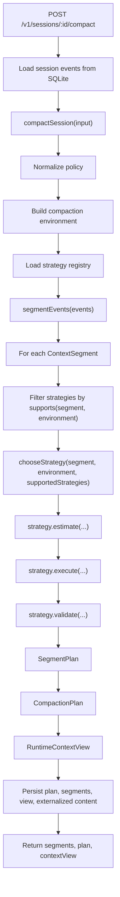

# Strategy Picker Data Flow

This document explains how the main compaction strategy picker works today.

The current implementation is deterministic and policy-driven. It does not yet use an LLM planner. That is intentional for V0: we want a clear baseline before adding model judgment.

## High-Level Flow



## Step 1: API Receives A Compaction Request

The API route is:

```http
POST /v1/sessions/:sessionId/compact
```

Request shape:

```json
{
  "objective": "Continue implementing the API",
  "desiredBudget": 8000,
  "policy": {
    "mode": "balanced",
    "preserveUserMessagesVerbatim": true,
    "preserveActiveErrorsVerbatim": false,
    "allowExternalRetrieval": true
  }
}
```

The API:

1. Validates the session exists.
2. Parses the request policy.
3. Loads the raw event log from SQLite.
4. Calls `compactSession(...)`.

Implementation entry point:

```ts
compactSession({
  sessionId,
  events: store.listEvents(sessionId),
  objective,
  desiredBudget,
  policy
});
```

## Step 2: Policy Is Normalized

Partial policies are expanded into defaults.

Current defaults:

```ts
{
  mode: "balanced",
  preserveUserMessagesVerbatim: true,
  preserveActiveErrorsVerbatim: true,
  allowExternalRetrieval: true,
  allowHandoff: true,
  requireApprovalForHighRiskChanges: true
}
```

This produces the `CompactionEnvironment`:

```ts
{
  objective,
  desiredBudget,
  policy
}
```

The environment is passed to every strategy so strategies can make policy-aware support and estimate decisions.

## Step 3: Events Become Context Segments

The segmenter currently maps each raw event to one `ContextSegment`.

It classifies each event using heuristic signals:

| Signal | Segment Field |
| --- | --- |
| User message with constraint words | `semanticType: "user_instruction"` |
| Tool output with error words | `semanticType: "active_error"` |
| Tool output without error words | `semanticType: "tool_observation"` |
| Decision event | `semanticType: "decision"` |
| Artifact event | `semanticType: "artifact_reference"` |
| Exploration/search language | `semanticType: "completed_exploration"` |
| Everything else | `semanticType: "general_context"` |

It also derives:

- `taskStage`
- `status`
- `artifacts`
- `importance`
- `futureRelevance`
- `exactnessRequired`
- `retrievable`
- `reconstructionCost`

Example segment:

```json
{
  "semanticType": "active_error",
  "taskStage": "debugging",
  "status": "active",
  "importance": 0.92,
  "futureRelevance": 0.9,
  "exactnessRequired": true,
  "retrievable": true,
  "reconstructionCost": "high"
}
```

## Step 4: Strategy Registry Is Loaded

The default registry is ordered:

```ts
[
  keepVerbatimStrategy,
  extractActiveErrorStrategy,
  externalizeLargeSegmentStrategy,
  maskToolOutputStrategy,
  structuredSummaryStrategy
]
```

Each strategy implements:

```ts
type CompactionStrategy = {
  name: string;
  supports(segment, environment): boolean;
  estimate(segment, environment): StrategyEstimate;
  execute(segment, environment): StrategyExecution;
  validate(original, transformed): StrategyValidation;
};
```

## Step 5: Supported Strategies Are Filtered

For each segment:

```ts
const supported = strategies.filter((strategy) =>
  strategy.supports(segment, environment)
);
```

Examples:

| Segment | Supported Strategies |
| --- | --- |
| `user_instruction` | `keep_verbatim` |
| `active_error` | `keep_verbatim`, `extract_active_error`, maybe `externalize_for_retrieval` |
| Large tool output | `externalize_for_retrieval`, `mask_tool_output`, `structured_summary` |
| General context | `structured_summary` |

If no strategy supports the segment, the fallback is `structured_summary`.

## Step 6: `chooseStrategy` Picks One

The current picker logic is deliberately simple.

### Rule 1: Cost-First Chooses Highest Estimated Savings

If:

```ts
policy.mode === "cost_first"
```

then the picker estimates every supported strategy and chooses the one with the highest `tokenSavings`.

```ts
supported
  .map((strategy) => ({ strategy, estimate: strategy.estimate(segment, environment) }))
  .sort((a, b) => b.estimate.tokenSavings - a.estimate.tokenSavings)[0].strategy
```

### Rule 2: Active Errors Can Be Extracted

If a segment is an active error and the policy allows non-verbatim active errors:

```ts
segment.semanticType === "active_error"
policy.preserveActiveErrorsVerbatim === false
```

then the picker prefers:

```text
extract_active_error
```

This preserves the useful debugging signal without keeping the entire noisy tool output.

### Rule 3: User Instructions And Exact Segments Stay Verbatim

If the segment is a user instruction or otherwise requires exactness:

```ts
segment.semanticType === "user_instruction" || segment.exactnessRequired
```

then the picker prefers:

```text
keep_verbatim
```

This is the core safety rule. User constraints should survive compaction exactly.

### Rule 4: Otherwise Use Registry Order

If none of the priority rules apply, the picker returns the first supported strategy from the registry.

Because the registry is ordered, this gives us a simple priority system:

```text
keep_verbatim
extract_active_error
externalize_for_retrieval
mask_tool_output
structured_summary
```

## Step 7: Chosen Strategy Produces A Segment Plan

After a strategy is chosen, `planSegment(...)` runs:

```ts
const estimate = strategy.estimate(segment, environment);
const result = strategy.execute(segment, environment);
const validation = strategy.validate(segment, result);
```

The output is a `SegmentPlan`:

```json
{
  "segmentId": "seg_...",
  "eventId": "evt_...",
  "semanticType": "active_error",
  "operation": "extract_active_error",
  "reason": "Active debugging context needs exact error signal without full noisy output.",
  "requiresHumanApproval": false,
  "estimate": {
    "tokenSavings": 1200,
    "preservationRisk": "medium",
    "latency": "low",
    "confidence": 0.88
  },
  "result": {
    "content": "Active error extracted from evt_...",
    "provenance": ["extracted error-bearing lines"],
    "tokenEstimate": 80
  },
  "validation": {
    "passed": true,
    "checks": ["active error signal retained"],
    "warnings": []
  }
}
```

## Step 8: Segment Plans Become A Compaction Plan

All segment plans are gathered into one `CompactionPlan`.

The plan records:

- Objective
- Policy
- Per-segment operation
- Reasons
- Estimates
- Results
- Validation warnings

This is the audit trail for why the context was compacted the way it was.

## Step 9: Segment Results Become Runtime Context

The runtime context view is assembled by joining transformed segment content:

```ts
segmentPlans
  .map((segment) => segment.result.content)
  .filter(Boolean)
  .join("\n\n---\n\n")
```

The view also records:

- `tokenEstimate`
- `externalReferences`
- `warnings`
- `planId`

This is the compacted context that a consuming agent would receive.

## Step 10: Persistence

The API persists:

- Raw events
- Derived segments
- Compaction plan
- Runtime context view
- Externalized content

Externalized content is stored when a strategy returns:

```ts
result.externalReference
```

The active context keeps the reference, while SQLite stores the full original segment content.

## Current Picker Behavior In One Table

| Input Segment | Policy | Picked Strategy |
| --- | --- | --- |
| User instruction | Any current mode | `keep_verbatim` |
| Active error | `preserveActiveErrorsVerbatim: true` | `keep_verbatim` |
| Active error | `preserveActiveErrorsVerbatim: false` | `extract_active_error` |
| Large retrievable segment | Balanced/default | `externalize_for_retrieval` |
| Tool output, not large | Balanced/default | `mask_tool_output` |
| General context | Balanced/default | `structured_summary` |
| Any segment | `cost_first` | Highest estimated token savings among supported strategies |

## Important Limitations

The picker does not yet:

- Split one raw event into multiple segments
- Use the desired token budget to iterate until the budget is met
- Ask human approval questions
- Use an LLM planner
- Compare downstream task success
- Learn from previous compaction outcomes

## Next Picker Improvements

### 1. Budget-Aware Planning

After first-pass strategy selection, calculate total context size. If it exceeds `desiredBudget`, make a second pass that upgrades eligible segments to more aggressive strategies.

### 2. Multi-Segment Event Splitting

A single event may contain both important and disposable content. Split long events into smaller semantic segments before strategy selection.

### 3. Human Decision Gateway

If a strategy has high preservation risk, return a question instead of blindly compacting.

### 4. LLM Planner

Use an LLM to enrich segment labels, estimate risk, and explain tradeoffs, while keeping deterministic safety rules for user instructions and exact facts.

### 5. Outcome-Aware Routing

Record downstream success metrics and eventually use them to improve routing choices.
